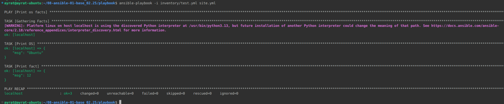

# Домашнее задание к занятию 1 «Введение в Ansible» Тукаев Айрат

## Подготовка к выполнению

1. Установите Ansible версии 2.10 или выше.
2. Создайте свой публичный репозиторий на GitHub с произвольным именем.
3. Скачайте [Playbook](./playbook/) из репозитория с домашним заданием и перенесите его в свой репозиторий.

## Основная часть

1. Попробуйте запустить playbook на окружении из `test.yml`, зафиксируйте значение, которое имеет факт `some_fact` для указанного хоста при выполнении playbook.  
 
**Выполнение:**  
```
ansible-playbook -i inventory/test.yml site.yml
```
    
  

2. Найдите файл с переменными (group_vars), в котором задаётся найденное в первом пункте значение, и поменяйте его на `all default fact`.  

**Выполнение:**  
У файла group_vars/all/examp.yml поменял значение  some_fact на 'all default fact'.  
```
---
  some_fact: all default fact
```


3. Воспользуйтесь подготовленным (используется `docker`) или создайте собственное окружение для проведения дальнейших испытаний.  

**Выполнение:**  
*docker-compose.yml*
```
services:
  centos7:
    image: pycontribs/centos:7
    container_name: centos7
    restart: unless-stopped
    entrypoint: "sleep infinity"
  ubuntu:
    image: pycontribs/ubuntu
    container_name: ubuntu
    restart: unless-stopped
    entrypoint: "sleep infinity"
```


4. Проведите запуск playbook на окружении из `prod.yml`. Зафиксируйте полученные значения `some_fact` для каждого из `managed host`.  

**Выполнение:**  
```
ansible-playbook -i inventory/prod.yml -v site.yml
```


5. Добавьте факты в `group_vars` каждой из групп хостов так, чтобы для `some_fact` получились значения: для `deb` — `deb default fact`, для `el` — `el default fact`.  

**Выполнение:**  


6.  Повторите запуск playbook на окружении `prod.yml`. Убедитесь, что выдаются корректные значения для всех хостов.  

**Выполнение:**  


7. При помощи `ansible-vault` зашифруйте факты в `group_vars/deb` и `group_vars/el` с паролем `netology`.  
**Выполнение:**  


8. Запустите playbook на окружении `prod.yml`. При запуске `ansible` должен запросить у вас пароль. Убедитесь в работоспособности.  
**Выполнение:**  


9. Посмотрите при помощи `ansible-doc` список плагинов для подключения. Выберите подходящий для работы на `control node`.  
**Выполнение:**  


10. В `prod.yml` добавьте новую группу хостов с именем  `local`, в ней разместите localhost с необходимым типом подключения.  
**Выполнение:**  


11. Запустите playbook на окружении `prod.yml`. При запуске `ansible` должен запросить у вас пароль. Убедитесь, что факты `some_fact` для каждого из хостов определены из верных `group_vars`.  
**Выполнение:**  


12. Заполните `README.md` ответами на вопросы. Сделайте `git push` в ветку `master`. В ответе отправьте ссылку на ваш открытый репозиторий с изменённым `playbook` и заполненным `README.md`.  
**Выполнение:**  


13. Предоставьте скриншоты результатов запуска команд.  
**Выполнение:**  


## Необязательная часть

1. При помощи `ansible-vault` расшифруйте все зашифрованные файлы с переменными.
2. Зашифруйте отдельное значение `PaSSw0rd` для переменной `some_fact` паролем `netology`. Добавьте полученное значение в `group_vars/all/exmp.yml`.
3. Запустите `playbook`, убедитесь, что для нужных хостов применился новый `fact`.
4. Добавьте новую группу хостов `fedora`, самостоятельно придумайте для неё переменную. В качестве образа можно использовать [этот вариант](https://hub.docker.com/r/pycontribs/fedora).
5. Напишите скрипт на bash: автоматизируйте поднятие необходимых контейнеров, запуск ansible-playbook и остановку контейнеров.
6. Все изменения должны быть зафиксированы и отправлены в ваш личный репозиторий.

---

### Как оформить решение задания

Приложите ссылку на ваше решение в поле «Ссылка на решение» и нажмите «Отправить решение»
---
